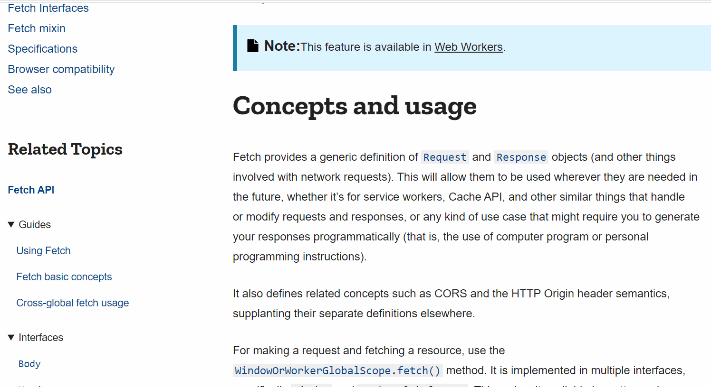
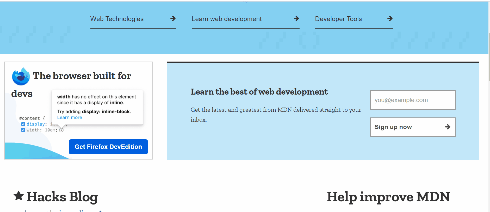

# translator
translator是一个简单的谷歌浏览器翻译插件，主要使用vue、jsx等技术进行开发，翻译功能则是基于开源项目（[google-translate-api](https://github.com/matheuss/google-translate-api)）实现。 
该插件主要功能有：
1. 划词翻译，调用 google translate 接口进行翻译，支持翻译多种语言；
2. 截图翻译，基于[tesseract.js](https://github.com/naptha/tesseract.js)实现图像识别，插件内置中文（简体）、英文、日文训练数据集，支持识别中文、英文、日文三种语言。

## 如何使用
1. 先获取插件安装包，这里有两种途径可获取： 
  (1) 克隆该项目或者下载项目源码，运行项目脚本自行构建； 
  (2) 到release页面下载已构建好的插件包，解压即可。
2. 在谷歌浏览器地址栏输入“chrome://extensions/”，跳转到扩展程序页面；
3. 点击扩展程序页面右上角的“开发者模式”开关，开启“开发者模式”；
4. 开启“开发者模式”后可以看到页面新增了几个按钮，点击其中的“加载已解压的扩展程序”按钮；
5. 在“选择扩展程序目录”对话框中选择存放着已经解压或者自行构建好的插件的文件夹。

## 插件截图
1. 划词翻译

2. 截图翻译

